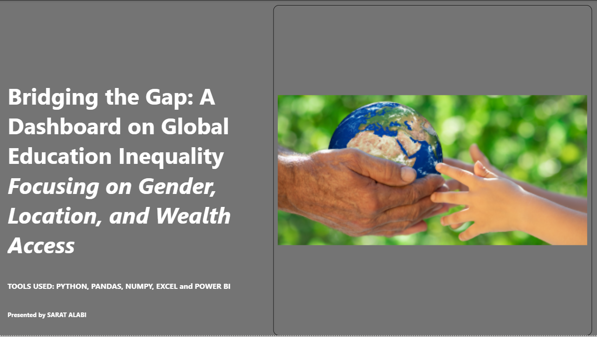
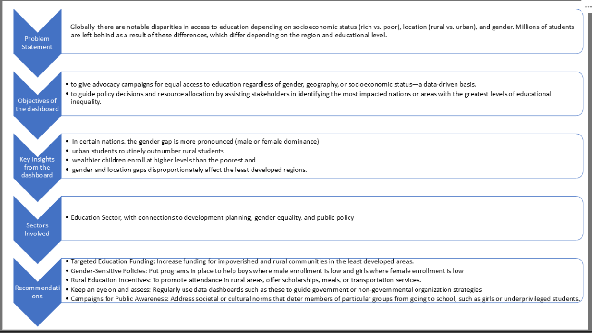
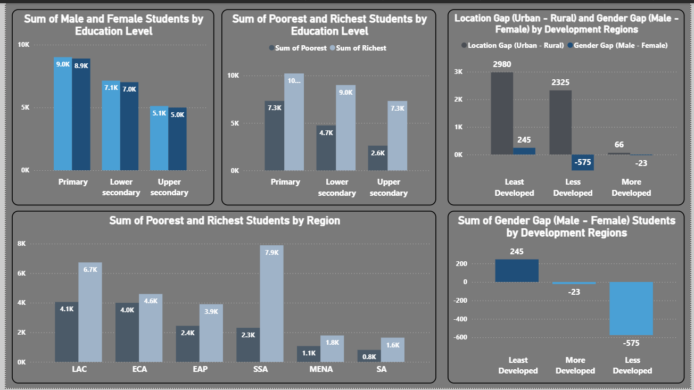

# Global Education Access and Inequality Analysis (Power BI + Python)

## Overview
This project examines completion rates across Primary, Lower Secondary, and Upper Secondary education levels.
The goal is to identify gaps in education based on gender, socioeconomic status, region, and location, and to highlight patterns of inequality across countries.

I used Python to clean and prepare the raw dataset, and Power BI to combine the cleaned sheets and build the dashboards.

## Tools Used:
1. Python (Pandas, NumPy, Matplotlib, and Seaborn)
2. Power BI
3. Excel
4. GitHub

## Dataset Description:
The dataset contains completion rate records for different education levels:
- Primary
- Lower Secondary
- Upper Secondary

## Each sheet includes information for multiple countries and variables like:
- Gender (Male, Female)
- Location (Urban, Rural)
- Wealth groups (Poorest, Second, Middle, Fourth, Richest)
- Development level
- Time period
- Total completion rate

## Data Cleaning Process (Python):
I used Python to clean each sheet separately before moving them into Power BI.

The steps were:
1. Loading the dataset:
I loaded all three sheets (“Primary”, “Lower secondary”, “Upper secondary”) into Jupyter Notebook.

2. Removal of unnecessary columns: I had 6 missing columns across all the sheets
I dropped fields such as:
- Data source
- Population data
- Blank/unnamed columns

3. Conversion to numeric columns:
Converted columns like Total, Female, Male, Rural, Urban, Poorest, Second, Middle, Fourth, Richest, and Time period to numeric values.

4. Handling of missing values:
- Dropped rows where important columns had less than 5% missing values
- Removed rows where all the numeric values were missing
- Filled missing wealth group values with the median
- Kept only the valid rows for each sheet
- Stopped the data entry after “Zimbabwe” to remove irrelevant entries - I deleted 23 irrelevant entries

5. Exporting of cleaned data:
Exported all cleaned sheets into a new Excel file named:
Completion_rate_2022_cleaned.xlsx

Each sheet was saved as:
- Primary
- Lower secondary
- Upper secondary

## Power BI Work:
After cleaning the dataset, I imported the three sheets into Power BI and created a model that allowed me to compare:
- Key Dimensions
- Gender
- Wealth groups
- Urban vs Rural
- Development regions
- Countries
- Education level

## Dashboards Created:
I built two dashboards:

1. Global Education Access Dashboard
This page focuses on:
- Gender gap
- Urban and rural differences
- Poorest vs richest completion rates
- Regional inequality
- Top countries with male advantage
- Bottom countries with female advantage

2. Deep Dive Dashboard:
This page looks at:
- Wealth distribution comparisons
- Region-specific inequalities
- Country-level breakdowns
- Education level patterns

These dashboards help highlight how completion rates of education change across different groups and regions.

## Insights from the Analysis:
Some of the key patterns found include:

- Males tend to have slightly higher completion rates in many countries.
- Urban students complete school more than rural students.
- The richest groups show far higher completion rates than the poorest groups.
- Least developed regions show the widest inequality gaps.
- Some countries have strong female dominance in completion rate, while others show a strong male advantage.

These insights reflect ongoing global inequality in access to education.

## Files in This Repository:
- Python script for data cleaning
- Cleaned dataset (Excel)
- Power BI file (.pbix)
- Dashboard screenshots
- README documentation

How to Use This Project

Download the cleaned dataset or the Power BI report.

Open the .pbix file in Power BI Desktop.

Use the filters (country, region, gender, level, year) to explore insights.

Check the Python script to see the full cleaning process.

## Conclusion:
This project demonstrates how data cleaning and visualization can be used to understand global education gaps.
Using Python for cleaning and Power BI for storytelling gave a clear view of how inequality affects completion rates across countries and regions.
